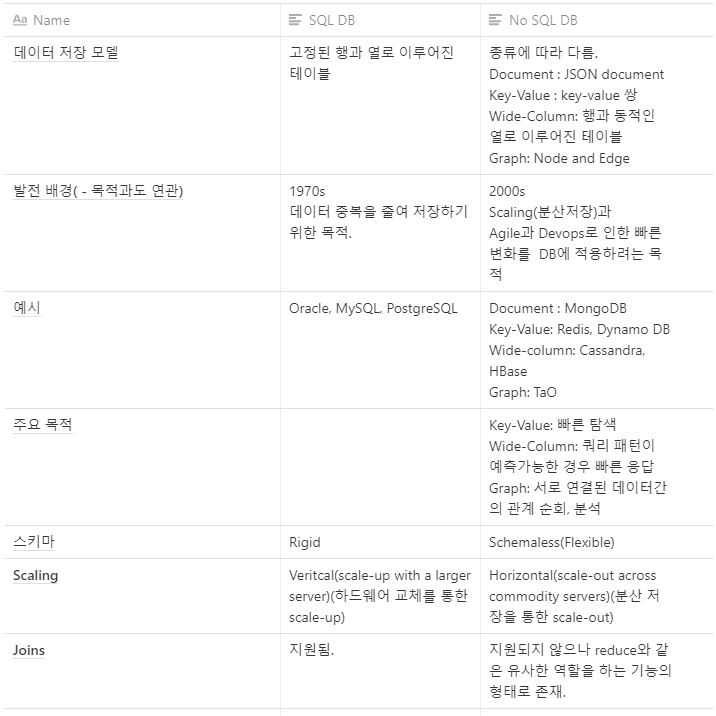

# 1. What is NoSQL

SQL은 학교 수업시간에 배우기도 하고, 실제 프로젝트할 때 사용해본 경험이 있어 어떤 것인지 이해가 갔지만, No SQL은 경험해본적이 없어서 처음에는 개념도 헷갈렸다.


## 1 - 1) DEFINITION

NO SQL : NOT only SQL, SQL만을 사용하지 않는 DBMS

⇒ RDBS를 사용하지 않는다는 의미가 아니라 여려 유형의 DB를 함께 사용하는 것을 의미한다.

NO SQL은 하나의 대상을 지칭하는 것이 아니라, SQL이 아닌 데이터를 저장하는 모든 방법을 의미한다.

EX) Redis, Cassandra, HBase, MongoDB, Firebase


## 1 - 2) BACK GROUND

21세기 들어, 웹 2.0 환경과 빅데이터의 등장으로 데이터를 처리하는데 필요한 비용이 급격히 증가 하였음. 기존 RDBS는 분산 저장이 불가능하여, 더 많은 데이터를 저장하기 위해 SCALE-UP(저장소의 성능 향상)이 필요한데, 이에 대한 비용이 많이 발생하면서 SQL을 벗어난 저장방식의 필요성이 대두 되었다. NOSQL은 RDBS의 일관성을 포기(TRADE-OFF)하고, 분산저장(SCALE-OUT)을 목표로 등장하였다.

```
TLDR: NoSQL (“non SQL” or “not only SQL”) databases were developed in the late 2000s with a focus on scaling, fast queries, allowing for frequent application changes, and making programming simpler for developers. Relational databases accessed with SQL (Structured Query Language) were developed in the 1970s with a focus on reducing data duplication as storage was much more costly than developer time. SQL databases tend to have rigid, complex, tabular schemas and typically require expensive vertical scaling.
```

출처) Mongo DB 공식 사이트.


## 1 - 3) NO SQL의 특징(SQL과의 차이점)

NO SQL은 위의 서술한 배경에서 등장하였기 때문에 아래와 같은 SQL과 구별되는 공통적인 성향을 가진다.

No SQL은 "대부분" 클러스터에서 실행할 목적으로 만들어 졌기 때문에 관계형 모델을 사용하지 않는다.

No SQL은 "대부분" 오픈 소스이다.

No SQL은 21C이후 웹 및 빅데이터의 대두이후 등장한 시스템만을 지칭한다.( 이 이전에 만들어진, ODBMS는 No SQL로 지칭하지 않는다.

Schmea-less, 스키마 없이 동작하며 구조에 대한 정의를 변경할 필요없이 데이터 베이스 레코드에 자유롭게 필드를 추가할 수 있다.


## 1 - 4) No SQL의 종류

No SQL은 앞서 설명 했듯이, SQL이 아닌 모든 데이터 저장방식을 일컫기 때문에 그 종류가 매우 많다. 대표적으로 자주 사용되는 No SQL인 집합 지향 모델(Document DB, Key-Value stores, Column-oriented DB 등), 그래프 모델(Graph DB)를 간단히 알아보자.


### A. 집합-지향(Aggregate-oriented) 모델

- Aggregate : 연산의 한단위로 취급되는 연관된 객체들의 집합.

- 엔티티에 대한 ACID 트랜잭션 X, 집합에 대한 트랜잭션 O

- 수평적 확장이 용이

why? RDB와 달리 데이터들이 연관되어 있다면 함께 움직이기 때문에.

- 키나, ID를 이용해서 빠른 검색이 가능함.

- RDB와 달리 조인 연산이 불가능 하나, MapReduce를 통해 유사한 연산을 구현.


### A - 1) Key - Value

- 말 그대로 키와 쌍의 값으로 데이터를 저장하며 값에는 어떠한 데이터라도 올 수 있다.(이미지, 비디오도 가능)

- 수평적 확장이 용이 하나, 값의 내용을 사용한 쿼리가 불가능하다.

- Redis, AMZ Dynamo DB, LeveIDB 등이 해당된다.


### A - 2) Document

- 데이터는 키와 Document 형태로 저장된다. Document란 계층이 있는 객체라고 이해할 수 있다.

- 객체-관계 매핑이 필요없고, 검색에 최적화가 되어 있다.

- MongoDB, Couch DB 등이 있다.


### B. 그래프 모델

- 개체와 관계를 그래프 형태로 표현한 형태.

- 데이터 간의 관계가 탐색의 키일 경우, 엔티티들이 서로 연결되어 있는 경 우 사용된다.

- 주로 SNS에서 이용된다. (facebook, Tao)


# 2. No SQL vs SQL


## 2 - 1) 비교표




## 2 - 2) No SQL의 장점(SQL과 비교해서)

한줄 요약 : 유연한 데이터 모델, 수평적 스케일링(분산저장), 빠른 쿼리 지원, 직관적인 이해 가능(개발자들이 일할때 편함)


### A. 유연한 스키마 모델.

: 유연한 스키마이기 때문에 요구사항이 변동됨에 따라 생기는 변경점을 DB에 적용하기 쉽다. 이는 유저의 요구사항을 빠르고 지속적으로 반영할 수 있게 한다.


### B. 수평적 스케일링

: 수직적 스케일링을 요구하는 SQL과 다르게, 분산된 서버를 통해 Scale-out이 가능하다. 이는 더 싼 가격으로 더 많은 데이터를 저장할 수 있음을 의미한다. 물론 이로 인해 DB의 일관성은 보장되지 못한다.(대부분)


### C. 빠른 쿼리

: No SQL의 쿼리가 SQL의 쿼리보다 빠르다. 왜냐하면 RDB는 정규화 되어 있기때문에, 쿼리 요청을 수행하기 위해서 여러 테이블에 대한 조인연산 등이 필요로 하게 되고 이는 성능저하를 야기한다. 반면 NoSQL에서는 DB를 쿼리에 최적화된 형태로 저장되기 때문에 여러 테이블에 접근할 필요없이 한테이블의 자료만으로 쿼리를 처리할 수 있다. 그러므로 더 빠르게 쿼리를 처리할 수 있다.


## 2-3) No SQL의 결함(단점)

가장 큰 결함, ACID(Atomicity, consistency, isolation, durability) 트랙잭션이 보장되지 못한다.

데이터의 중복을 제거하지 않고 쿼리에 최적화된 형태로 저장하기 때문에, 당연히 같은 데이터 저장에 대해 더 많은 공간이 필요하다

어떤 No SQL을 선택하느냐에 따라서, 더 많은 DB가 필요해질수 있다.(상황에 잘 맞는 No SQL을 선택하는 것이 중요하다)


# 3. 면접에서 어떤 질문으로 물어볼까?(내 나름 예상질문 및 각종 블로그 참고함)

Q1. 관계형 데이터베이스와 비 관계형 데이터베이스 차이점에 대해 설명해보세요.

Q2. RDBMS과 비교하였을 때 NoSQL의 장점을 설명해보세요.

Q3. 어떤상황에서 NoSQL을 쓰는 것이 더 적합한가?

Q4. SQL(RDB)의 장점과 단점

Q5. 실제 프로젝트에서 SQL, No SQL을 사용한 경험과 해당 DB를 선택한 이유?

—- DBA로 지원하는거 아니면 이 이상의 질문은 안하지 않을까??....


# 4. 참고링크, 자료


1. No-SQL 에 대한 정보 : 몽고DB 공식사이트 , 나무위키(좌측 사이트와 설명 유사 번역정도로 생각)

2. No - SQL 적용 사례(Naver D2, 오래된 자료) https://d2.naver.com/helloworld/1039

3. No-SQL vs SQL

유튜브 1 : https://www.youtube.com/watch?v=Q_9cFgzZr8Q

유튜브 2 : https://www.youtube.com/watch?v=5llIti9VK48


4. No-SQL vs SQL 깃허브 비교

깃허브 1 : No SQL = Nosql 중 Document를 이용하는 Mongo DB로 놓고 서술(잘은 모르지만 이렇게 답변하면 태클 받을지도 모른다는 생각이듬)

깃허브 2 : 직접 비교 설명은 없으나, 각각의 개념에 대한 내용이 잘 서술되어있음.

https://github.com/JaeYeopHan/Interview_Question_for_Beginner/tree/master/Database#nosql


5. 실제 면접 질문

블로그 : 피면접자(?)가 사용해보지 않았더라면 각각의 장단점, 언제 사용해야하는지, 구체적인 예 시를 들어 설명할 수 있는지 정도는 꼭기억해야하는 듯 하다??(면접을 본건아니라서 잘모름)
